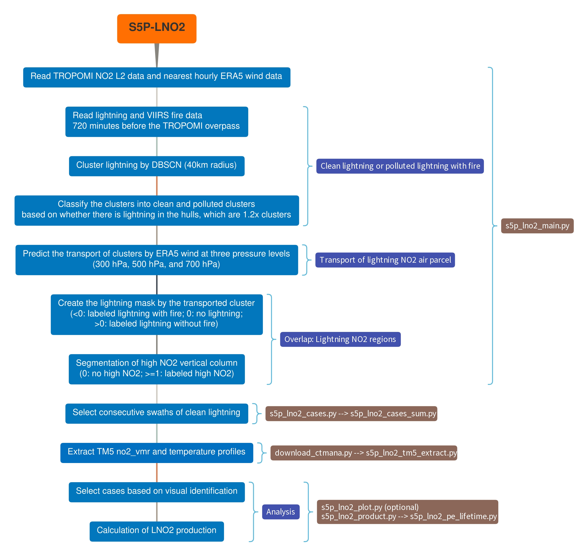

# S5P-LNO2

[](https://doi.org/10.5281/zenodo.7549851)

Core code for the TROPOMI lightning NO2 (LNO2) retrievals. Some useful Jupyter Notebooks are available at [S5P-LNO2-Notebook](https://github.com/zxdawn/S5P-LNO2-Notebook).

- [x] Pairing lightning and fire data with TROPOMI NO2 L2 product considering the transport
- [x] LNO2 mask
- [x] Consecutive swaths with lightning
- [x] Retrieval of lightning NO2 vertical column density
- [x] LNO2 production efficiency based on consecutive swaths data
- [ ] [TROPOMI CO data for wildfire](https://github.com/zxdawn/S5P-LNO2/issues/13)
- [ ] [Integration of cloud slicing](https://github.com/zxdawn/S5P-LNO2/issues/16) (see [forked era-uptrop](https://github.com/zxdawn/erc-uptrop))

## Main workflow

Users need to prepare the *Input Data* first and then run the scripts one by one.

Please feel free to modify the *settings.txt* file for your own research.



Detailed explanations of main scripts:

1. Select lightning-swaths with both lightning and high NO2, and save them to nc files. [*s5p_lno2_main.py*]
2. Link the consecutive lightning-swath cases and save variables (case No., filename, and mask label) to csv files. [*s5p_lno2_cases.py*]
2. Combine the generated csv file into fresh\_lightning\_cases.csv or nolightning\_cases.csv.  [*s5p_lno2_cases_sum.py*]
2. (Optional) Plot linked variables and save them as images to filter cases manually [*s5p_lno2_plot.py*]. We are still thinking how to convert the manual part into an auto one.
3. Extract TM5 no2\_vmr and temperature profiles for consecutive lightning-swaths. [*s5p_lno2_tm5_extract.py*]
5. Calculate lightning variables (AMFs, SCD_Bkgd, tropopause_pressure, lno2vis, lno2_geo and lno2) and save them to one netcdf file called "S5P_LNO2.nc" [*s5p_lno2_product.py*]
6. Calculate lightning NO2 production efficiency and save all useful variables to one CSV file called "S5P_LNO2_PE.csv". [*s5p_lno2_pe_lifetime.py*]

## Input Data

The used data are listed below.

The input paths are shown in parentheses. Please feel free to modify them in `settings.txt`.

1. TROPOMI (`<s5p_dir>/<yyymm>/S5P_**__L2__NO2____`)

   There're three main methods of downloading the TROPOMI NO2 L2 data:

   - [Sentinel-5P Pre-Operations Data Hub](https://s5phub.copernicus.eu/dhus/#/home)
   - [GES DISC](https://disc.gsfc.nasa.gov/datasets/S5P_L2__NO2____HiR_1/summary)
   - [S5P-PAL](https://data-portal.s5p-pal.com/): this is the reprocessed NO2 data from April 2018 - September 2021. The two sources above will be updated soon.

2. [ERA5](https://doi.org/10.24381/cds.bd0915c6) (`<era5_dir>/era5_<yyyymm>.nc`)

   The pressure level (200 - 700 hPa) ERA5 data (u and v) are used to predict the transport of lightning air in the upper troposphere.

   Note that for the TROPOMI data on the first day of month, we need the ERA5 data on the last day of the previous month.

   e.g. `S5P...20220201...` needs `era5_202201.nc` which at least has the data on 2022-01-31.

3. Lightning Data (`<lightning_dir>/<yyymm>/<yyyymmdd>.csv`)

   The lightning data should be saved in CSV format and have at least three fields: timestamp, longitude, and latitude.

4. VIIRS S-NPP fire product

   The archive VIIRS S-NPP data is available from [FIRMS](https://firms.modaps.eosdis.nasa.gov/download/).

## Other useful functions

1. Regrid TROPOMI product (s5p_regrid.py and s5p_regrid_combine.py)

   The [harp](https://github.com/stcorp/harp) tool is convient for regridding TROPOMI L2 data to Lon/Lat grids with filters.

2. Calculate the TROPOMI pixel areas (s5p_pixel_area.py)

​		Usually the areas are same for different swaths. We calculated all possible areas and saved it into one netCDF file for usage.

3. Calculate lightning within TROPOMI swaths (swath_lightning.py)

​		It is useful to know how many lightning happened inside the swaths before the TROPOMI overpass.

4. Grid lightning NO2 product (s5p_lno2_grid.py)
5. Generate daily and summertime GLD360 data (gld360_daily.py and gld360_summer.py)

## Outputs

### 1. L2 product with new variables (netCDF file)

<details><summary>(Click to expand) s5p_lno2_main.py adds lightning/fire data and lightning masks to simplified L2 product. </summary>
<p>

| Varname                                        | Group     | Units                                                        | Description                                                  |
| ---------------------------------------------- | --------- | ------------------------------------------------------------ | ------------------------------------------------------------ |
| time                                           | S5P       | days since \<yyyy-mm-dd\>                                    | time using proleptic gregorian calendar                      |
| latitude                                       | S5P       | degrees_north                                                | pixel center latitude                                        |
| longitude                                      | S5P       | degrees_east                                                 | pixel center longitude                                       |
| air_mass_factor_clear                          | S5P       | 1                                                            | Air mass factor for the cloud-free part of the scene         |
| air_mass_factor_cloudy                         | S5P       | 1                                                            | Air mass factor for the cloud-covered part of the scene      |
| air_mass_factor_stratosphere                   | S5P       | 1                                                            | Stratospheric air mass factor                                |
| air_mass_factor_total                          | S5P       | 1                                                            | Total air mass factor                                        |
| air_mass_factor_troposphere                    | S5P       | 1                                                            | Tropospheric air mass factor                                 |
| Apparent_scene_pressure                        | S5P       | Pa                                                           | Scene pressure from the cloud product                        |
| assembled_lat_bounds                           | S5P       | degrees_north                                                | assembled_latitude_bounds calculated by Satpy                |
| assembled_lon_bounds                           | S5P       | degrees_east                                                 | assembled_longitude_bounds calculated by Satpy               |
| Averaging_kernel                               | S5P       | 1                                                            | Averaging kernel                                             |
| cloud_albedo_crb                               | S5P       | 1                                                            | Cloud albedo in the cloud product                            |
| cloud_fraction_crb_nitrogendioxide_window      | S5P       | 1                                                            | Cloud fraction at 440 nm for NO2 retrieval                   |
| cloud_pressure_crb                             | S5P       | Pa                                                           | Cloud optical centroid pressure                              |
| cloud_radiance_fraction_nitrogendioxide_window | S5P       | 1                                                            | Cloud radiance fraction at 440 nm for NO2 retrieval          |
| Geolocation_flags                              | S5P       | 1                                                            | Some flags (see ATBD)                                        |
| **lightning_mask**                             | S5P       | 1                                                            | <0: labeled lightning with fire; <br />0: no lightning; <br />>0: labeled lightning without fire |
| nitrogendioxide_ghost_column                   | S5P       | mol m-2                                                      | Ghost column NO2: modelled NO2 column below the cloud top    |
| **nitrogendioxide_segmentation**               | S5P       | 1                                                            | 0: no high NO2;<br />>=1: labeled high NO2                   |
| nitrogendioxide_slant_column_density           | S5P       | mol m-2                                                      | Stratospheric vertical column of nitrogen dioxide, derived from the TM5-MP vertical profiles |
| nitrogendioxide_stratospheric_column           | S5P       | mol m-2                                                      | Stratospheric vertical column of nitrogen dioxide, derived from the TM5-MP vertical profile |
| nitrogendioxide_total_column                   | S5P       | mol m-2                                                      | Total vertical column of nitrogen dioxide derived from the total slant column and TM5 profile in stratosphere and troposphere |
| nitrogendioxide_tropospheric_column            | S5P       | mol m-2                                                      | Tropospheric vertical column of nitrogen dioxide             |
| processing_quality_flags                       | S5P       | 1                                                            | Processing quality flags (See ATBD)                          |
| qa_value                                       | S5P       | 1                                                            | Quality value                                                |
| scene_albedo                                   | S5P       | 1                                                            | Scene albedo in the cloud product                            |
| snow_ice_flag                                  | S5P       | 1                                                            | Snow-ice mask (See ATBD)                                     |
| solar_azimuth_angle                            | S5P       | degree<br />clockwise from the North (East = 90, South = 180, West = 270) | Solar azimuth angle at the ground pixel location on the reference ellipsoid. |
| solar_zenith_angle                             | S5P       | degree<br />measured away from the vertical                  | Solar zenith angle at the ground pixel location on the reference ellipsoid. |
| surface_albedo_nitrogendioxide_window          | S5P       | 1                                                            | Surface albedo in the NO2 fit window                         |
| surface_pressure                               | S5P       | Pa                                                           | Surface pressure                                             |
| time_utc                                       | S5P       | 1                                                            | Time of observation as ISO 8601 date-time string             |
| tm5_constant_a                                 | S5P       | Pa                                                           | TM5 hybrid A coefficient at upper and lower interface levels |
| tm5_constant_b                                 | S5P       | Pa                                                           | TM5 hybrid B coefficient at upper and lower interface levels |
| tm5_tropopause_layer_index                     | S5P       | 1                                                            | TM5 layer index of the highest layer in the tropopause       |
| viewing_azimuth_angle                          | S5P       | degree<br />measured clockwise from the North (East = 90, South = 180, West = 270) | Satellite azimuth angle at the ground pixel location on the reference ellipsoid. |
| viewing_zenith_angle                           | S5P       | degree<br />measured away from the vertical                  | Zenith angle of the satellite at the ground pixel location on the reference ellipsoid. |
|                                                |           |                                                              |                                                              |
|                                                |           |                                                              |                                                              |
|                                                |           |                                                              |                                                              |
|                                                |           |                                                              |                                                              |
| cluster_label                                  | Lightning | 1                                                            | Clustered lightning labeled by DBSCAN                        |
| time                                           | Lightning | minutes since                                                |                                                              |
| longitude                                      | Lightning | degrees_east                                                 | Longitude of lightning                                       |
| latitude                                       | Lightning | degrees_north                                                | Latitude of lightning                                        |
| delta                                          | Lightning | minute                                                       | The time difference between detected lightning and TROPOMI overpass time |
| level                                          | Lightning | hPa                                                          | Pressure levels used for lightning NO2 air parcel            |
| longitude_pred                                 | Lightning | degrees_east                                                 | Longitude of lightning at different pressure levels predicted by ERA5 data |
| latitude_pred                                  | Lightning | degrees_north                                                | Latitude of lightning at different pressure levels predicted by ERA5 data |
| lightning_label                                | Lightning | 1                                                            | Lightning label paired with lightning mask                   |
|                                                |           |                                                              |                                                              |
|                                                |           |                                                              |                                                              |
|                                                |           |                                                              |                                                              |
| time                                           | Fire      | 1                                                            |                                                              |
| longitude                                      | Fire      | degrees_north                                                | Longitude of fire                                            |
| latitude                                       | Fire      | degrees_north                                                | Longitude of fire                                            |
| type                                           | Fire      | 1                                                            | Fire type                                                    |

</p>
</details>

### 2. Lightning NO2 production and lifetime (netCDF file)

The lightning no2 data (S5P_LNO2_production.nc and S5P_LNO2_lifetime.nc) includes the products of netCDF file and other new retrievals (see [S5P-WRFCHEM](https://github.com/zxdawn/S5P-WRFChem/blob/master/doc/users_guide/S5P-WRFChem_UG_ch03_product.md), but we use a priori NO2 profiles assuming guassian distributions instead of WRF--Chem results).

<details><summary>(Click to expand) Data Structure </summary>
<p>

```
- Case 1
	-	Swath xxx
		- S5P
		 - .......... (official S5P data as shown above)
		 - scdTrop
		 - lightning_mask
		 - area
		 - amfTrop
		 - amfTropVis
		 - swClr
		 - swCld
		 - avgKernel
		 - no2apriori
		 - no2Trop
		 - no2TropVis
		 - scdClr
		 - scdCld
		 - vcdGnd
		 - tropopause_pressure
		 - plevels
		 - scdBkgd
		 - amflno2
		 - lno2_mask
		 - lno2vis
		 - lno2geo
		 - lno2
		- Lightning
	- Swath xxx
	...
- Case 2
.....
```

</p>
</details>

### 3. Lightning NO2 production and lifetime (csv file)

The csv files contain two kinds of variable:

- Data from previous netcdf files.
- Lightning NO2 production efficiency based on consecutive swaths.

csv head: time,case,swath,longitude,latitude,region,nlightning,area,apparent_scene_pressure,no2,lno2geo,lno2vis,lno2,pe_lno2geo,pe_lno2vis,pe_lno2

## Publications

Zhang et al., [**Spaceborne observations of lightning NO2 in the Arctic**](https://doi.org/10.1021/acs.est.2c07988), *Environ. Sci. Technol.*
